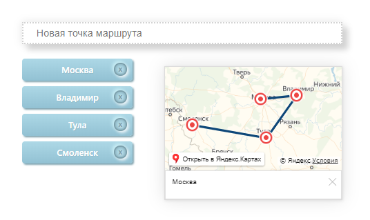

### Редактор маршрутов

Для запуска проекта на локальном компьютере надо ввести `npm start` в командной строке.

Реализован редактор маршрутов — одностраничное приложение, в
котором пользователь в интерактивном режиме может создавать на карте
маршрут, указывая начальную, конечную и промежуточные точки движения. Для
каждой точки маршрута можно посмотреть ее адрес.

Приложение визуально состоит из:
* текстового поля ввода для новых точек маршрута;
* списка уже введенных точек маршрута;
* интерактивной карты.

<!--   -->

Приложение должно адекватно вести себя при
изменении размера окна браузера, взаимное расположение элементов не должно
изменяться.

Новая точка маршрута добавляется с помощью ввода ее названия в текстовом
поле и нажатия Enter. После этого:
* введенная точка маршрута отображается в конце списка уже добавленных
точек;
* в текущем центре карты появляется маркер, обозначающий новую точку
маршрута.

Напротив каждой точки маршрута в списке находится кнопка удаления, при ее
нажатии точка маршрута пропадает из списка, а с карты пропадает ее маркер.
Порядок точек маршрута в списке можно изменять перетаскиванием.
Маркеры, соответствующие точкам маршрута, можно перемещать по карте
перетаскиванием.
Маркеры на карте соединены прямыми линиями в том порядке, в котором они
находятся в списке. Полученная таким образом ломаная изображает маршрут,
первая точка в списке — начало маршрута, последняя — конец маршрута.
При изменении порядка точек в списке или их удалении, а также при перемещении
маркеров маршрут на карте автоматически перерисовывается.
При клике на маркер появляется балун, в балуне отображается название
соответствующей ему точки. 
